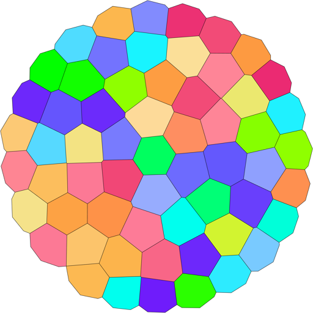
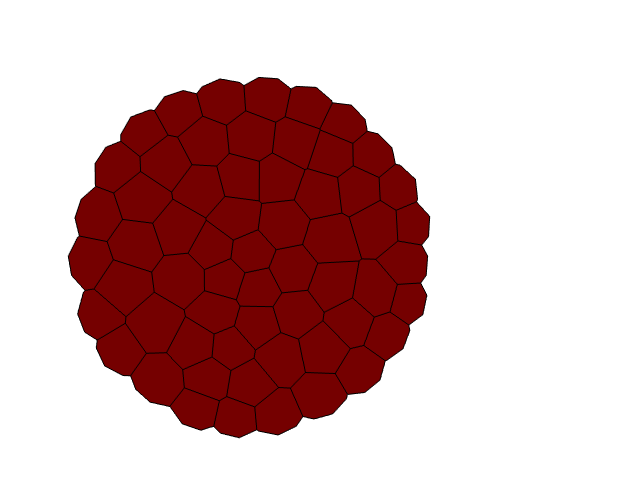
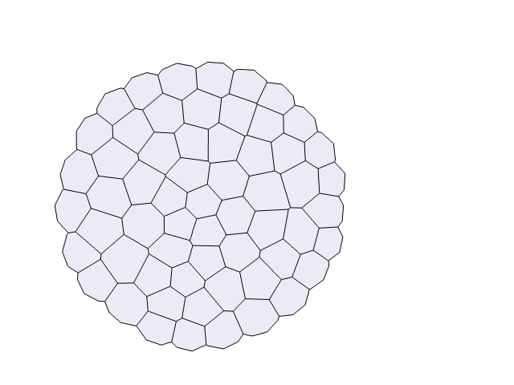
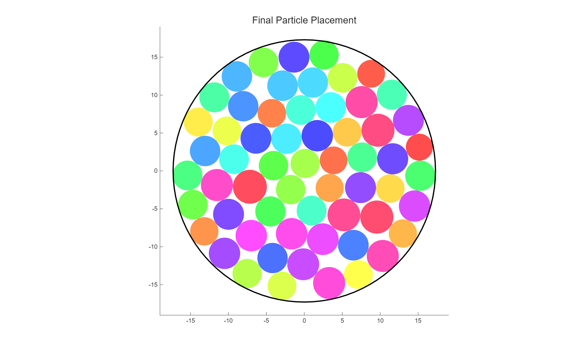
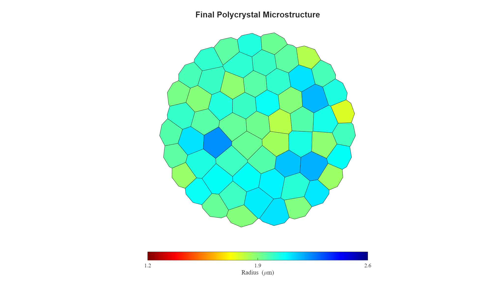
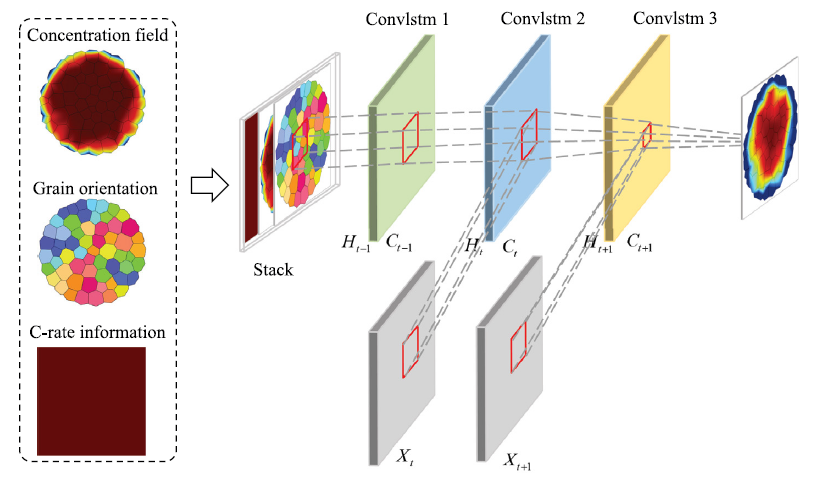
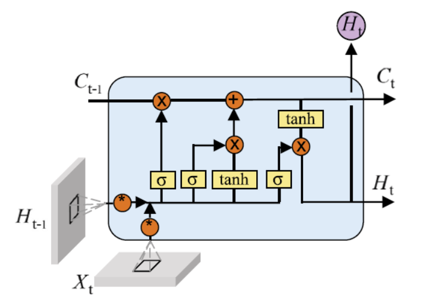
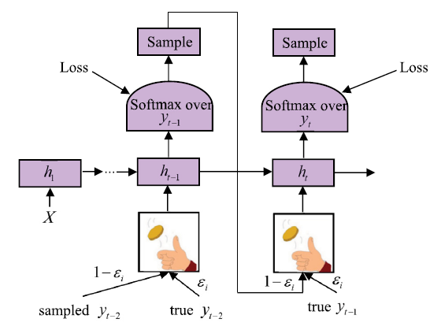
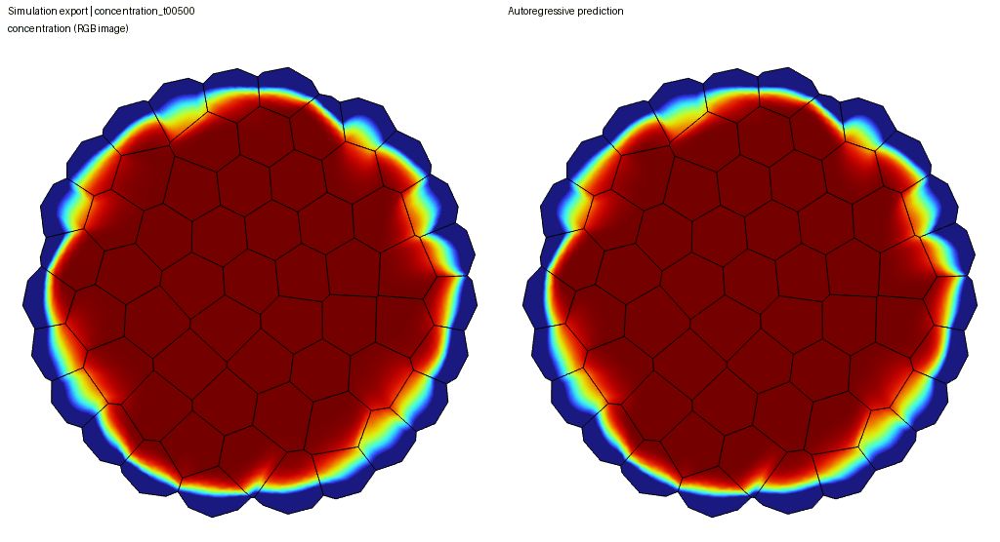
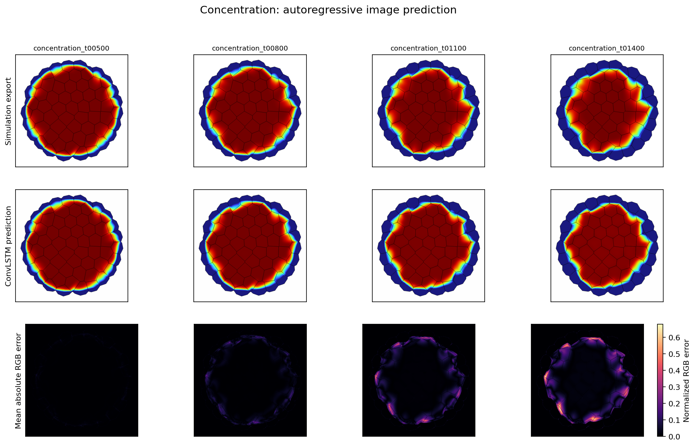

# ConvLSTM Prediction of Battery Material Fields

**Yanghao Chen · Tongji University**

Predict the evolution of concentration and stress images in polycrystalline
battery materials with a conditional ConvLSTM. The workflow connects
MATLAB–COMSOL data generation, MSE + SSIM training, and autoregressive prediction
in PyTorch.

[Sample](#what-one-simulation-case-contains) · [Dataset generation](#dataset-and-simulation-workflow) · [Model](#model-architecture) · [Training](#training-strategy) · [5C results](#5c-prediction-results) · [Run the workflow](#quick-start) · [Documentation](#documentation) · [Research homepage](https://cyhcyh070126-bot.github.io/)

- **Model:** a Conv3d feature extractor followed by three ConvLSTM layers and an RGB decoder.
- **Inputs:** five field-history images, a grain-orientation map, and a C-rate map.
- **Learning task:** next-frame prediction followed by ten-step autoregressive fine-tuning with MSE + SSIM.

The bundled data and checkpoint support prediction on CPU or GPU. MATLAB and
COMSOL are required only to generate new simulation cases. Concentration and
stress are separate prediction targets; the included checkpoint predicts concentration.

## What one simulation case contains

The worked sample throughout this README is **5C, case 93203**:
`N=60_Lognormal_mu=2.00_sigma=0.10_R0=17.288_C=5_ID=93203`.
It was generated from 60 initial packing particles and contains 512 × 512 RGB
field exports at 100-second intervals from 0 to 2400 seconds. See the [dataset inventory](docs/dataset-inventory.json)
and [image-format documentation](docs/data-format.md).

A **simulation case** describes one microstructure, its loading condition, and
its field evolution. At the default export settings, its image collection is:

| Image group | PNGs per case | Role |
| :--- | ---: | :--- |
| Concentration | 25 | Field sequence at 0, 100, …, 2400 s |
| Von Mises stress | 25 | Mechanical response at the same times |
| Grain orientation | 1 | Static microstructure input |
| C-rate | 1 | Static loading-condition input |
| Geometry construction | 4 | Radius distribution, initial/final packing, and Voronoi grains |
| **Total** | **56** | **52 learning images + 4 construction plots** |

The learning images are organized in `1_Concentration/`, `2_Stress/`,
`3_Voronoi_Geometry/05_*.png`, and `C-rate/5C.png` for this case.

The 52 learning images are 512 × 512 RGB. The four original construction plots
retain their 2027 × 1221 resolution. For case 93203, all 56 images are available:
the learning images are in [`examples/data/`](examples/data/), and the construction
plots are in [`assets/sample-5c/`](assets/sample-5c/).
New MATLAB–COMSOL runs also save geometry and run metadata (`.mat`) together
with the solved COMSOL model (`.mph`). The
[illustrated sample guide](docs/simulation-sample.md) explains each file and how
one case becomes many training windows.

### Static conditioning and evolving fields

| Grain-orientation input | C-rate input: 5C |
| :---: | :---: |
|  |  |

The orientation map colors each grain by its folded crystal orientation.
The C-rate image is spatially uniform: this case encodes 5C as RGB `(153, 0, 0)`.
Its three channels are carried alongside the three orientation channels at
every time step as a conditioning input.

The [conditioning guide](docs/simulation-sample.md#additional-orientation-map-example)
also includes the additional grain-orientation image shown on the research homepage.

| Concentration evolution | Von Mises stress evolution |
| :---: | :---: |
|  |  |

These simulation-reference animations from the
[research homepage](https://cyhcyh070126-bot.github.io/cv/) illustrate the two
time-dependent fields. The [5C sample guide](docs/simulation-sample.md#3-field-sequences)
shows concentration and stress snapshots from case 93203 at labeled physical times.
The [5C results](#5c-prediction-results) show the pretrained concentration prediction for that same case.

<a id="1-dataset-and-the-5c-example"></a>

## Dataset and simulation workflow

MATLAB and COMSOL generate each case together through LiveLink for MATLAB:

1. **Construct the microstructure.** MATLAB samples particle radii, relaxes the
   particle positions, constructs Voronoi grains, and assigns crystal orientations.
2. **Solve the physical fields.** MATLAB creates and configures the COMSOL model;
   COMSOL solves anisotropic transport and solid mechanics with concentration-driven swelling.
3. **Export the learning data.** MATLAB controls the time-dependent solve and
   image export, pairing concentration and von Mises stress sequences with static
   orientation and C-rate maps. Python then forms prediction windows from these images.

The simulation archive spans **261 complete cases** across 0.5C, 1C, 2C, 3C, 4C, and 5C.
The repository provides **two complete example cases**, each with 25 concentration
frames, 25 stress frames, and the associated conditioning maps, ready for
prediction and training walkthroughs. The archive's C-rate distribution is:

| C-rate | 0.5C | 1C | 2C | 3C | 4C | 5C |
| :--- | ---: | ---: | ---: | ---: | ---: | ---: |
| Archived cases | 40 | 43 | 43 | 43 | 43 | 49 |

### From particles to grains

| Final particle packing, case 93203 | Voronoi grains colored by seed-particle radius |
| :---: | :---: |
|  |  |

The circles on the left show the relaxed particle positions used to construct
the grains. Their colors distinguish particles. On the right, polygon colors
encode the generating particles' radii using the displayed micrometre scale.
The [full gallery](docs/simulation-sample.md#1-microstructure-construction) also
shows the radius distribution and initial placement.

### Generate new MATLAB–COMSOL cases

Use a MATLAB session connected to COMSOL LiveLink:

```matlab
addpath('matlab');
run_dir = run_workflow(fullfile(pwd, 'outputs', 'matlab'), '', 5, 42);
```

The final arguments select 5C and random seed 42. The [MATLAB guide](docs/matlab-workflow.md)
details dependencies and outputs. MATLAB is not needed to use the bundled images.

### Choose particle count and radius distribution

Set the geometry options before calling `run_workflow`; these select the
existing branches in [`main_D21origin.m`](matlab/geometry/main_D21origin.m).

| Parameter | What to change | Saved-source default | Worked 5C case 93203 |
| :--- | :--- | :--- | :--- |
| `N` | Number of initial packing particles / Voronoi seeds; an integer ≥ 3 | `60` | `60` |
| `command` | Radius distribution: `1` = Weibull, `2` = Lognormal, `3` = Normal | `3` (Normal) | `2` (Lognormal) |
| `mu` | Radius mean parameter in µm; positive | `2` | `2` |
| `sigma` | Radius standard-deviation parameter in µm; positive | `0.35` | `0.10` |

For example, generate a new **80-particle Lognormal** case:

```matlab
addpath('matlab');
geometry_options = struct();
geometry_options.N = 80;        % Change to 40, 60, 80, ...
geometry_options.command = 2;   % 1: Weibull; 2: Lognormal; 3: Normal
geometry_options.mu = 2.00;     % Radius mean parameter, micrometres
geometry_options.sigma = 0.15;  % Radius standard deviation, micrometres

c_rate = 5;                     % Loading condition: 5C
random_seed = 42;               % Use [] for randomly seeded geometry
run_dir = run_workflow(fullfile(pwd, 'outputs', 'matlab'), ...
    '', c_rate, random_seed, geometry_options);
```

Change `geometry_options.N` to choose the particle count. Change
`geometry_options.command` to switch distributions; edit `mu` and `sigma` to
change the radius statistics. For Lognormal radii, these are radius-space mean
and standard deviation; the original code converts them to log-space parameters.
For Weibull radii, the original code fits shape and scale from the same two
parameters. All three branches retain the original binning and sample-count
adjustment; their sampled statistics need not equal the requested parameters
exactly.

`N` counts the initial seeds, so the final number of polygons after boundary
clipping can differ. The initial `R0` is calculated from the sampled radii and
the original packing fraction, and the packing loop can expand it to reduce
overlap; it is not an independent `geometry_options` field. Change
`c_rate` for another loading condition and `random_seed` for another random
realization. These settings generate a new case; they do not recreate archived
case 93203, whose original seed is not supplied.

Omitted geometry fields retain their saved-source defaults. The
[MATLAB guide](docs/matlab-workflow.md#original-settings) describes the full
setup and output files.

### From simulated cases to network samples

A simulation case contains the complete field evolution for one microstructure
and loading condition. A training example is a history/target window drawn from
that case. For the selected field, Python pairs each history frame with the
same grain-orientation and C-rate maps, preserving their spatial alignment.

| Training stage | History → target frames | Windows per 25-frame case | Training patches per case |
| :--- | :---: | ---: | ---: |
| Initial next-frame training | 5 → 1 | 20 | 320 |
| Sequence fine-tuning | 5 → 10 | 11 | 176 |

A 512 × 512 image supplies sixteen non-overlapping 128 × 128 patches.
Sequence validation uses the 11 full-image windows. See
[window construction](docs/simulation-sample.md#4-from-one-case-to-training-examples)
for the tensor shapes.

Case splitting occurs before temporal windows are formed. Checkpoints saved by
the training commands retain their case split, and fine-tuning inherits it
across the two stages. This keeps overlapping windows from the same simulation
out of different training and validation partitions.

The files connect the stages as follows:

| File or folder | Produced by | Used next for |
| :--- | :--- | :--- |
| `geometry_for_comsol.mat` | Particle packing and Voronoi construction | COMSOL geometry and crystal-orientation assignment |
| Solved `.mph` model | Coupled transient COMSOL solve | Concentration and stress image export |
| `1_Concentration/`, `2_Stress/` | Time-aligned field export | Separate concentration or stress prediction windows |
| `3_Voronoi_Geometry/05_*.png`, `C-rate/*.png` | Static conditioning export | Six conditioning channels alongside each RGB field frame |
| `run_metadata.mat` | MATLAB workflow | Geometry options, seed, loading and packing diagnostics |
| `split.json`, saved checkpoint | Python training | Case partitions, model weights and subsequent fine-tuning/evaluation |

<a id="2-model-and-convlstm-cell"></a>

## Model architecture



Field history and static conditioning maps enter a recurrent predictor. In this
implementation, a Conv3d feature extractor precedes the ConvLSTM layers, as
specified in the configuration table below.
Illustration source: Wang et al., Figure 5, [Energy Storage Materials 82 (2025),
104581](https://doi.org/10.1016/j.ensm.2025.104581).

Each training example takes a **five-frame history**, with nine channels per frame:
three field channels, three grain-orientation channels, and three C-rate
channels. Pixel values are normalized to `[0, 1]`.

For example, the first concentration window uses **0, 100, 200, 300, and 400 s**.
The initial training stage targets **500 s**; sequence fine-tuning targets
**500–1400 s**. The two static maps accompany every history frame, and the
target contains only the three RGB channels of the selected field.

| Component | Implemented configuration |
| --- | --- |
| Input | `(batch, 5, 9, height, width)` |
| Conv3d | 9 → 32 channels; kernel `(3, 5, 5)`; padding `(1, 2, 2)` |
| ConvLSTM | Three layers; 32 hidden channels each; 5 × 5 recurrent kernels |
| Output projection | 1 × 1 Conv2d, 32 → 3 channels |
| Output activation | Sigmoid |
| Trainable parameters | 636,515 |

Conv3d extracts local temporal and spatial features before recurrent processing.
The hidden state at the final input time is decoded into the next RGB field. During a rollout,
that prediction is appended to the five-frame window with the same static
conditioning maps. Each model call initializes its recurrent states as in the
selected source implementation.



Here, $X_t$ denotes the input feature map, $H_t$ the hidden state, and $C_t$ the
cell state. Convolutional input, forget, and output gates retain the spatial grid
while updating information through time.
Illustration source: Wang et al., Figure 4, [same article](https://doi.org/10.1016/j.ensm.2025.104581).

<a id="3-training-strategy"></a>

## Training strategy

The code provides initial next-frame training and subsequent multi-step
fine-tuning. The first stage learns local prediction from five previous frames.
The sequence stage unrolls ten future steps and gradually replaces ground-truth
feedback with the model's own predictions through scheduled sampling.



Scheduled sampling chooses which field to feed into the next prediction window:
the simulation reference with probability $\epsilon$, or the model prediction
with probability $1-\epsilon$. The model applies this strategy to continuous RGB
regression with a sigmoid output. Illustration: Figure 6 in
[Wang et al.](https://doi.org/10.1016/j.ensm.2025.104581), also used on the homepage.

| Setting | Initial training | Sequence fine-tuning |
| :--- | :---: | :---: |
| History → target frames | 5 → 1 | 5 → 10 |
| Training patch | 128 × 128 | 128 × 128 |
| Validation region | 128 × 128 patches | 512 × 512 images |
| Batch size | 64 | 16 |
| Epochs | 100 | 50 |
| Adam learning rate | `1e-3` | `1e-5` |

Both stages use 512 × 512 source images and gradient-norm clipping at 5.

Training uses joint spatial augmentation of field and static channels.
Sequence teacher-forcing probability is `max(0, 1 - step * 1e-5)`.
The [5C example](#5c-prediction-results) evaluates the supplied pretrained weights.

Concentration and stress use separate models. The supplied pretrained weights
and 5C predictions are for **concentration**. The dataset also includes stress
images for training through `--field stress`.

<a id="4-mse--ssim-objective"></a>

### MSE + SSIM objective

Both stages use the same supervised objective:

```math
\mathcal{L}=\mathrm{MSE}(\hat{I},I)+0.05\left[1-\mathrm{SSIM}(\hat{I},I)\right]
```

MSE measures pixelwise differences, while SSIM compares image structure.
Both terms are computed on normalized RGB images. Multi-step fine-tuning
averages this objective over the predicted future frames.

<a id="5-pretrained-weights-and-5c-prediction-results"></a>

## 5C prediction results

The 5C example uses five reference frames from **0–400 s** to predict ten
future frames at **500–1400 s**, at 512 × 512 resolution. Each predicted frame
is fed back into the input window; future reference frames are used for evaluation.

[Pretrained checkpoint](checkpoints/mse-ssim-pretrained.pth) · [Checkpoint provenance](docs/checkpoint-provenance.json)





In the GIF, the simulation reference is on the left and the autoregressive
prediction is on the right; the labels identify physical time. In the static
comparison, each column is a predicted time: reference above, prediction in the
middle, and mean absolute RGB error below. Brighter error-map regions indicate
larger differences on the normalized image scale.

[Open the comparison PDF](assets/results/5c/comparison.pdf) ·
[Per-frame metrics CSV](assets/results/5c/metrics.csv) ·
[Evaluation settings and summary](assets/results/5c/evaluation.json)

| Metric | Mean over 10 frames | Preferred direction |
| :--- | ---: | :--- |
| MSE | 0.00271848 | Lower |
| SSIM | 0.968459 | Higher |

Metrics are computed on normalized RGB images, including background pixels,
for this **5C case study**. They quantify image agreement with the simulation
reference. The CSV reports each predicted time separately; the
[evaluation record](docs/checkpoint-provenance.json) identifies the checkpoint and settings.

<a id="6-run-the-example"></a>

## Quick start

Use **Python 3.12** for the tested installation below. No GPU is needed for the
quick preview. Run all commands from the repository root.

```bash
git clone https://github.com/cyhcyh070126-bot/convlstm-battery-field-prediction.git
cd convlstm-battery-field-prediction
python -m venv .venv
```

Activate with `.venv\Scripts\Activate.ps1` on Windows PowerShell, or
`source .venv/bin/activate` on Linux/macOS. If PowerShell blocks activation,
replace `python` in the remaining commands with `.venv\Scripts\python.exe`;
no system policy change is needed. For the tested Windows CPU installation
(the CPU index also provides Linux wheels):

```bash
python -m pip install torch==2.10.0 --index-url https://download.pytorch.org/whl/cpu
python -m pip install -r requirements.txt
python -m pip check
```

For CUDA or macOS, choose the matching build using the
[PyTorch installation selector](https://pytorch.org/get-started/locally/)
before installing `requirements.txt`. The CPU build above cannot use CUDA.

### Run a CPU preview

This uses the supplied MSE + SSIM weights,
resizes the images to 64 × 64, and predicts three steps:

```bash
python -m python.evaluation.predict --case-dir "examples/data/N=60_Lognormal_mu=2.00_sigma=0.10_R0=17.288_C=5_ID=93203" --checkpoint checkpoints/mse-ssim-pretrained.pth --output-dir outputs/5c-preview --field concentration --image-size 64 --predict-length 3 --device cpu
```

Open `outputs/5c-preview/rollout.gif` or `comparison.png`. Expect three predicted
PNG frames, a comparison PNG/PDF, a GIF, `metrics.csv`, and `evaluation.json`.
The preview uses a smaller spatial grid and shorter rollout. To reproduce the
configuration of the [displayed results](#5c-prediction-results), use the next command.

### Reproduce the 5C evaluation

Use the full 512 × 512 images and predict ten steps:

```bash
python -m python.evaluation.predict --case-dir "examples/data/N=60_Lognormal_mu=2.00_sigma=0.10_R0=17.288_C=5_ID=93203" --checkpoint checkpoints/mse-ssim-pretrained.pth --output-dir outputs/5c-prediction --field concentration --predict-length 10
```

Use a new or empty output directory. The evaluator writes a comparison PNG/PDF,
GIF, predicted PNG frames, per-frame CSV metrics, and a JSON report. The default
device is CUDA when available, otherwise CPU. Full-resolution execution is much
heavier than the preview; published figures were evaluated on a GPU.
See [setup, expected files, and common errors](docs/getting-started.md).

<a id="7-train-or-generate-new-data"></a>

<a id="train-and-generate-data"></a>

## Train on the dataset

### Check the training pipeline

For a short CPU execution check with the bundled cases:

```bash
python -m python.train.single_frame --data-dir examples/data --output-dir outputs/smoke --field concentration --epochs 1 --batch-size 1 --val-batch-size 1 --image-size 32 --patch-size 32 --max-batches 1 --device cpu
```

Success produces `best_model.pt`, `config.json`, `split.json`, and `history.csv`.
This command processes one training batch and one validation batch to check
installation and checkpoint saving. The
[complete CPU walkthrough](docs/getting-started.md#check-both-training-stages)
also tests sequence fine-tuning and reloading its saved weights.

### Train on a case collection

Arrange your cases as in the [data-format guide](docs/data-format.md), then run the two stages in order:

```bash
python -m python.train.single_frame --data-dir data/export_images --output-dir outputs/concentration-initial --field concentration
python -m python.train.sequence --data-dir data/export_images --checkpoint outputs/concentration-initial/best_model.pt --output-dir outputs/concentration-sequence --field concentration
```

Use `--field stress` with separate output directories to train a stress model.
The bundled cases support the execution walkthrough. For a research experiment,
point `--data-dir` to your case collection and retain the case-level split.
Run `--help` for configurable batch sizes, device, learning rate, and rollout length.

Default batch sizes are 64 for initial training and 16 for sequence training.
For a memory-efficient starting configuration, use `--batch-size 1 --val-batch-size 1`,
especially for ten-step training. Static-image caching is bounded to eight cases
per dataset instance per worker; `--num-workers 0` is the simplest starting point.
`--checkpoint` initializes weights for a new fine-tuning run with a fresh
optimizer and sampling schedule. Use a new or empty output directory for each run.

## Documentation

The [complete source audit](docs/source-audit.md) records every normal-workflow
MATLAB/Python original, saved version, dependency and fix. Original bytes and
separately reviewed copies are available in `source_archive/` and `research_scripts/`.
The current quick start uses the selected normal model; historical versions
remain distinct.

| Guide | What it covers |
| :--- | :--- |
| [Getting started](docs/getting-started.md) | Installation, expected outputs, and troubleshooting |
| [A complete simulation sample](docs/simulation-sample.md) | Microstructure, field images, conditioning maps, and training windows |
| [MATLAB workflow](docs/matlab-workflow.md) | Geometry generation, COMSOL setup, and image export |
| [Data format](docs/data-format.md) | Folder layout and image conventions |
| [Reproducibility](docs/reproducibility.md) | Verified environments, execution records, and checks |

For common setup problems, see [troubleshooting](docs/getting-started.md#troubleshooting).

## Repository layout and checks

```text
matlab/        Geometry, COMSOL model construction, and image export
python/        Models, image loading, training, and evaluation
source_archive/ Exact original source snapshots, for provenance
research_scripts/ Reviewed original versions, with explicit patch records
checkpoints/   Included MSE + SSIM pretrained weights
examples/      Two complete sample cases and source hashes
assets/        Existing architecture illustrations, 5C inputs, and prediction figures
docs/          Data format, simulation setup, source provenance, and reproducibility
tests/         Functional model/data/checkpoint checks
```

Run `python -m unittest discover -s tests -v`. The 15 Python tests cover
model execution, data loading, checkpoints, output protection and original-source
numerical parity. Additional
checks cover the two-stage training walkthrough, 5C prediction, MATLAB syntax,
and six image-export tests. See [reproducibility notes](docs/reproducibility.md)
for environments and execution records.

## References and attribution

- Wang, Z., Zhao, Y., Zhong, Z., and Xu, B.-X. *Deep-learning based prediction of chemo-mechanics and damage in battery active materials*. Energy Storage Materials 82 (2025), 104581. [Article](https://doi.org/10.1016/j.ensm.2025.104581). Figures 4–6 correspond to the existing homepage illustrations reused above; they are not covered by the ConvLSTM code license.
- The recurrent implementation follows [ndrplz/ConvLSTM_pytorch](https://github.com/ndrplz/ConvLSTM_pytorch); its [MIT notice](third_party/ConvLSTM_pytorch-LICENSE) is retained.
- SSIM uses [pytorch-msssim](https://github.com/VainF/pytorch-msssim).

See [third-party notices](THIRD_PARTY_NOTICES.md) for attribution and licensing scope.
