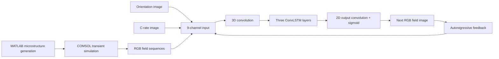
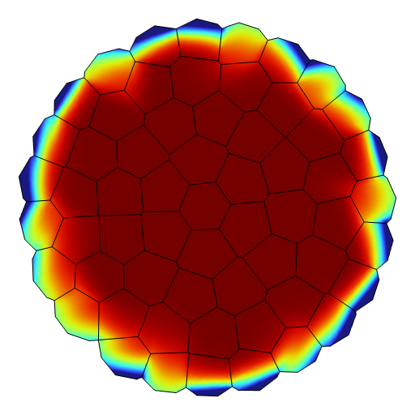
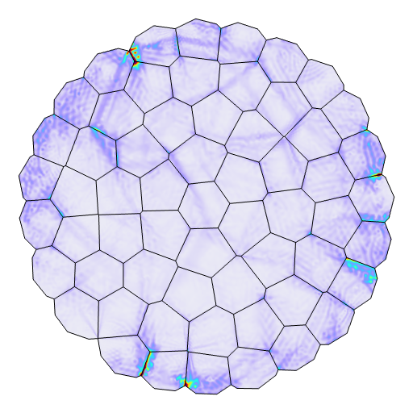

# ConvLSTM Forecasting of Battery Material Fields

MATLAB–COMSOL data generation and conditional ConvLSTM forecasting of rendered concentration and stress images in polycrystalline battery materials.

**Yanghao Chen · Tongji University**

[Research homepage](https://cyhcyh070126-bot.github.io/) · [MATLAB workflow](docs/matlab-workflow.md) · [Data format](docs/data-format.md) · [Reproducibility notes](docs/reproducibility.md)

## Simulation examples

| Lithium concentration | von Mises stress |
| :---: | :---: |
|  |  |

These animations show **simulation reference sequences**. They illustrate the time-dependent fields in the dataset; they are not neural-network predictions or a performance comparison.

## Approach

The workflow generates polycrystalline microstructures, solves coupled transport and solid mechanics in COMSOL, and exports RGB image sequences. A conditional model uses five previous field images together with grain-orientation and C-rate images to predict the next field image. Repeated predictions form an autoregressive rollout.



The training objective is

$$\mathcal{L}=\operatorname{MSE}(\hat{I},I)+0.05\,[1-\operatorname{SSIM}(\hat{I},I)].$$

Both terms act on RGB pixels normalized to `[0, 1]`. This repository contains the **MSE + SSIM baseline**. Training has two stages: single-frame prediction, followed by multi-step fine-tuning with scheduled sampling.

| Orientation input | Concentration reference | Stress reference |
| :---: | :---: | :---: |
|  |  |  |

The field panels are exports at 1000 seconds from the included 1C example. Orientation colors and field colormaps encode different quantities. The historical image exports have different plotting margins; they have not been geometrically registered in this release.

## Repository layout

```text
matlab/
  run_workflow.m       MATLAB entry point
  geometry/           Particle packing and Voronoi microstructures
  simulation/         COMSOL model construction and transient solve
  export/             RGB sequences and static conditioning images
python/
  models/             ConvLSTM cells and forecasting model
  data/               Case discovery, loading, and spatial patches
  train/              Single-frame and sequence training
  evaluation/         Rollouts, image metrics, PNG/PDF/GIF export
examples/data/        Two small, complete simulation cases
assets/               Images and animations displayed in this README
docs/                 Setup, data format, and reproducibility details
tests/                Lightweight correctness checks
```

## Python setup

Run commands from the repository root. The preparation checks used Python 3.12 and PyTorch 2.10; a GPU is useful for the original 512-pixel images and long rollouts.

```bash
git clone https://github.com/cyhcyh070126-bot/convlstm-battery-field-prediction.git
cd convlstm-battery-field-prediction
python -m venv .venv
```

Activate the environment with `.venv\Scripts\Activate.ps1` in Windows PowerShell, or `source .venv/bin/activate` on Linux/macOS. Install the PyTorch build appropriate for your hardware, then the remaining dependencies:

```bash
python -m pip install -r requirements.txt
```

MATLAB and COMSOL are only needed to generate new simulations. The bundled image cases can be loaded and used by Python independently.

## Try the included data

The two cases in [`examples/data`](examples/data) make the file format and training entry points easy to inspect. They are **a small execution example**, not a dataset for estimating generalization performance.

Run a reduced-size, one-batch training check:

```bash
python -m python.train.single_frame --data-dir examples/data --output-dir outputs/smoke --field concentration --epochs 1 --batch-size 1 --val-batch-size 1 --image-size 32 --patch-size 32 --max-batches 1 --device cpu
```

This deliberately small run checks that loading, forward propagation, MSE + SSIM, backpropagation, validation, and checkpoint writing work. It does not produce a scientifically trained model. The original training resolution is 512 pixels with 128-pixel training patches.

## Train on your dataset

Arrange independent simulation cases as documented in [`docs/data-format.md`](docs/data-format.md). These examples assume their parent directory is `data/export_images`.

**1. Single-frame training**

```bash
python -m python.train.single_frame --data-dir data/export_images --output-dir outputs/concentration-single --field concentration
```

**2. Multi-step fine-tuning**

```bash
python -m python.train.sequence --data-dir data/export_images --output-dir outputs/concentration-sequence --field concentration --checkpoint outputs/concentration-single/best_model.pt
```

Use `--help` on either command to adjust batch size, device, learning rate, patch size, or rollout length. Sequence fine-tuning reuses the saved case split from a packaged checkpoint. This keeps cases used in pretraining out of its validation partition. See the [reproducibility notes](docs/reproducibility.md) for handling older checkpoints.

The selected historical training scripts target **concentration**. The data reader also supports the `2_Stress` exports through `--field stress`; train a separate stress model and use separate output directories. No previously trained stress-model accuracy is claimed here.

## Predict and export figures

After training, select a simulation case and a checkpoint:

```bash
python -m python.evaluation.predict --case-dir data/export_images/YOUR_CASE --checkpoint outputs/concentration-sequence/best_model.pt --output-dir outputs/prediction --field concentration --predict-length 10
```

The evaluation command saves:

- `comparison.png` and `comparison.pdf`: simulation, prediction, and absolute RGB-error panels;
- `rollout.gif`: side-by-side reference and prediction animation;
- `predicted_frames/`: individual predicted PNGs;
- `metrics.csv`: per-frame RGB MSE and SSIM;
- `evaluation.json`: the selected case, field, settings, and aggregate image metrics.

Choose a new or empty output directory for each evaluation so that frames and
animations from different runs cannot be mixed.

MSE and SSIM measure agreement between **rendered images**, including their background pixels. They are not concentration errors in mol/m³ or stress errors in Pa. No pretrained checkpoint is bundled with this initial code release.

## Generate new data with MATLAB

Open a MATLAB session connected to COMSOL through LiveLink, then run:

```matlab
addpath('matlab');
run_dir = run_workflow(fullfile(pwd, 'outputs', 'matlab'), '', 5, 42);
```

The last two arguments select the C-rate and random seed. Outputs appear under `outputs/matlab/export_images`. The [MATLAB guide](docs/matlab-workflow.md) describes toolboxes, the LiveLink connection, model settings, and export filenames.

## Validation and scope

```bash
python -m unittest discover -s tests -v
```

Validation covers the Python model/data pipeline and small training/evaluation runs. MATLAB scripts were checked with R2025b, with small geometry-helper checks. A full COMSOL simulation and a full training campaign were not rerun during repository preparation. Detailed checks and the changes made while organizing the source are recorded in [reproducibility notes](docs/reproducibility.md).

## References and attribution

- Shi et al., [Convolutional LSTM Network: A Machine Learning Approach for Precipitation Nowcasting](https://arxiv.org/abs/1506.04214), 2015.
- The recurrent-cell implementation follows [ndrplz/ConvLSTM_pytorch](https://github.com/ndrplz/ConvLSTM_pytorch). Its MIT notice is retained in [`third_party/ConvLSTM_pytorch-LICENSE`](third_party/ConvLSTM_pytorch-LICENSE).
- SSIM is implemented through [pytorch-msssim](https://github.com/VainF/pytorch-msssim).

See [third-party notices](THIRD_PARTY_NOTICES.md) for attribution and licensing scope.
