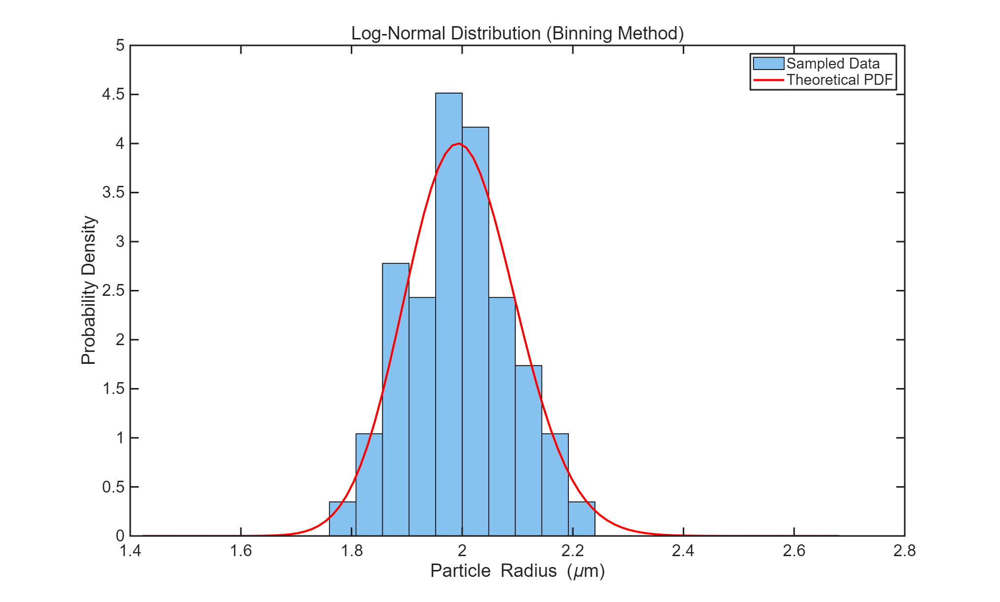
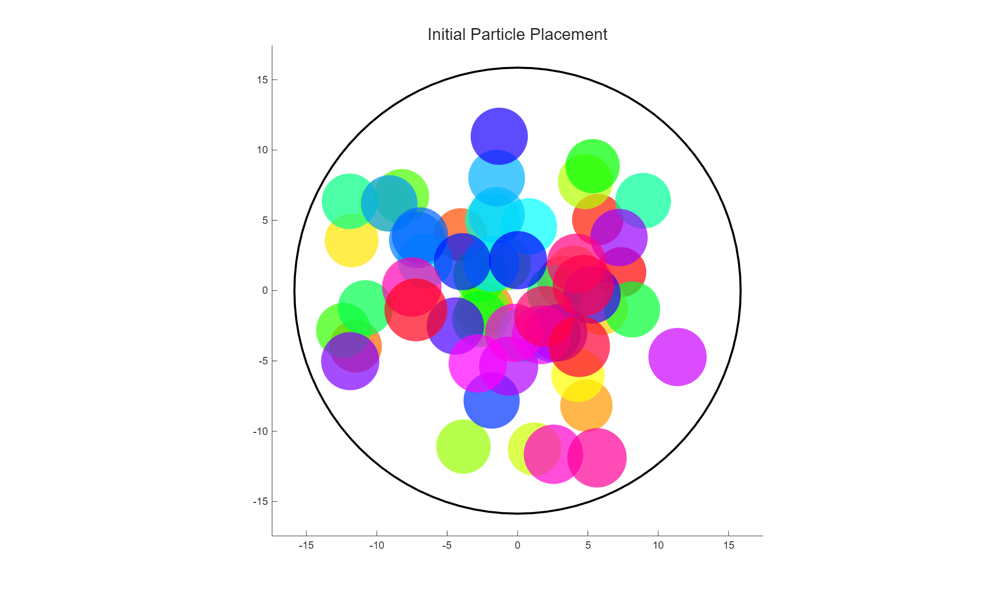
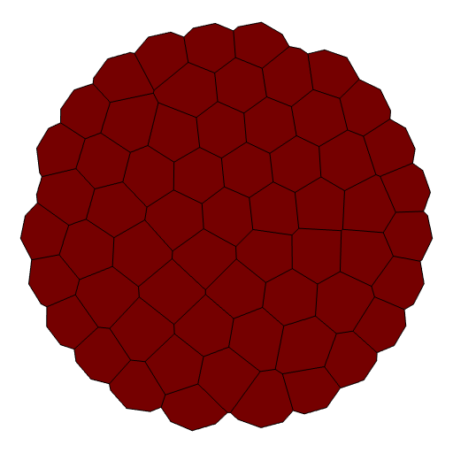
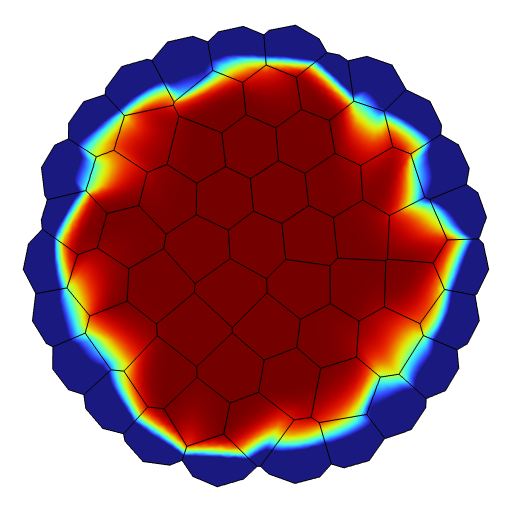
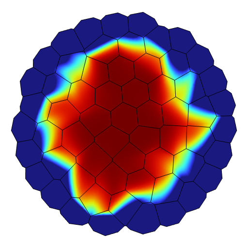
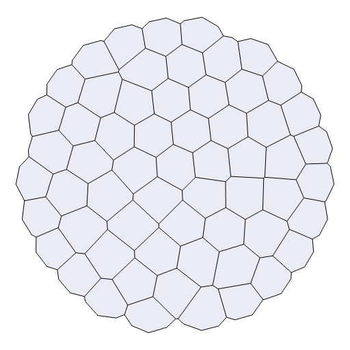
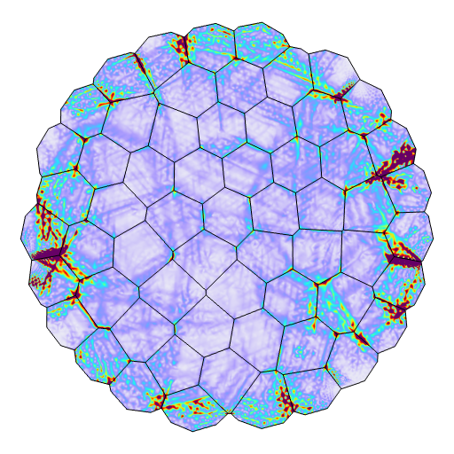
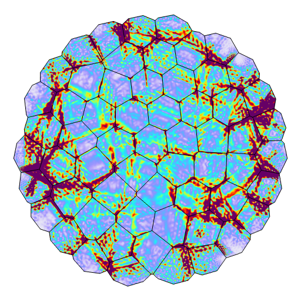

# A complete MATLAB–COMSOL simulation sample

A simulation case combines a particle-based microstructure, crystal orientations,
a C-rate, and the resulting concentration and stress histories. This illustrated
guide follows the **5C case 93203** used in the pretrained prediction example.

[Microstructure](#1-microstructure-construction) ·
[Conditioning maps](#2-static-conditioning-maps) ·
[Field sequences](#3-field-sequences) ·
[Training examples](#4-from-one-case-to-training-examples) ·
[Simulation files](#5-files-created-by-a-new-joint-simulation)

| Case setting | Value |
| --- | --- |
| Case ID | `93203` |
| Initial packing particles | 60 |
| Radius distribution | Lognormal; configured mean 2.00 μm, standard deviation 0.10 μm |
| Outer radius recorded in the folder name | 17.288 μm |
| Loading condition | 5C |
| Exported physical times | 0, 100, 200, …, 2400 s |
| Learning-image format | 512 × 512 RGB PNG |

The full case name is
`N=60_Lognormal_mu=2.00_sigma=0.10_R0=17.288_C=5_ID=93203`.
Its **56 original PNGs** are available in this repository: 52 learning images
in the [example directory](../examples/data/N=60_Lognormal_mu=2.00_sigma=0.10_R0=17.288_C=5_ID=93203/)
and four construction plots in [the geometry gallery](../assets/sample-5c/).
All are original exports; their hashes are recorded in the
[example manifest](../examples/manifest.json) and
[figure provenance](figure-provenance.json).

## 1. Microstructure construction

MATLAB samples particle radii and places the particles inside a circular
boundary. Contact-force relaxation adjusts their positions. Their centers then
define a Voronoi tessellation, and COMSOL clips the polygonal geometry to the
circular domain while retaining internal grain boundaries.

| Sampled radii and distribution | Initial particle placement |
| :---: | :---: |
|  |  |
| **Read the histogram:** blue bars show the sampled radius density; the red curve is the configured lognormal probability density. The horizontal axis is in micrometres. | **Read the positions:** the black circle is the packing boundary. Colored discs distinguish particles and show their initial overlap. |

| Relaxed particle placement | Radius-colored Voronoi microstructure |
| :---: | :---: |
|  |  |
| **Read the packing:** the particle centers supply the seeds for constructing the grains. Disc colors identify particles. | **Read the grains:** black lines outline Voronoi cells. Colors indicate the generating particle's radius on the original 1.2–2.6 μm scale, from red to blue. |

The filename `04_Voronoi_Uncolored.png` is retained from the source; the displayed
quantity is the **seed-particle radius**. The four construction figures preserve
their original 2027 × 1221 resolution. They document geometry generation;
the orientation map below supplies the network's structural conditioning.

The lognormal sampler takes the configured radius mean and standard deviation
and converts them to log-space parameters internally. The supplied generator
also supports normal and Weibull distributions. Its default configuration uses
normal radii with mean 2.00 μm and standard deviation 0.35 μm; `command`, `mu`,
and `sigma` in [the geometry script](../matlab/geometry/main_D21origin.m) select
the desired particle ensemble.

## 2. Static conditioning maps

| Crystal-orientation map | 5C conditioning map |
| :---: | :---: |
|  |  |

**Orientation.** Each grain is assigned a crystal orientation. The geometry
script combines its polar position angle with a sampled local angle to obtain
$\beta$, then folds $\beta$ into $[0,\pi/2]$ for color encoding. The original
filename is `05_Voronoi_Theta_Colored.png`; the rendered map encodes this folded
**beta orientation**. The original image extents and colors are preserved.

**C-rate.** A single loading condition is represented by a spatially uniform
three-channel image. For 5C, each pixel is RGB **(153, 0, 0)**, or **(0.6, 0, 0)**
after division by 255. Repeating this map across time provides the same loading
condition alongside every input field. The exporter interpolates colors between
its 0.5C, 1C, 2C, 3C, 4C, and 5C anchors.

Together these maps contribute **six static channels**. They remain fixed within
one simulation case while the concentration and stress fields evolve.
The [data-format guide](data-format.md#image-representation) describes image
coordinates and normalization.

## 3. Field sequences

Through LiveLink, MATLAB assigns grain-wise rotated coordinate systems in
COMSOL. The physical model uses anisotropic species transport and anisotropic
linear elasticity, coupled through hygroscopic swelling: concentration changes
produce strain and a mechanical response. The loading C-rate sets the transport
flux parameter. COMSOL solves the transient problem, and MATLAB exports the
selected result fields at 25 physical times.

The following **simulation references all belong to case 93203**. Columns use
the same time in both rows, so field evolution can be compared directly.

| Field | 0 s | 1000 s | 2400 s |
| --- | :---: | :---: | :---: |
| Concentration |  |  |  |
| von Mises stress |  |  |  |

The exporter renders concentration `c` with the **Rainbow** color table and
von Mises stress `solid.mises` with **Prism**. Their configured upper color
limits are `4.5e4 mol/m³` and `5e8 Pa`, respectively. Each field has its own
color encoding. The model learns these RGB representations, and its reported
MSE and SSIM describe normalized image agreement.

File suffixes encode seconds: `concentration_t01000.png` is the concentration
at **1000 s**. There are 25 concentration images and 25 stress images, with
the same time list from 0 to 2400 s. The
[pretrained prediction example](../README.md#5-pretrained-weights-and-5c-prediction-results)
compares the concentration forecasts with these simulation references.

## 4. From one case to training examples

A **simulation case** is the complete microstructure and its time series.
A **training example** is a sliding history/target window from that series,
optionally restricted to a spatial patch. Select concentration or stress as
the target field for a training run.

| Part of the first window | Physical times | Contents |
| --- | --- | --- |
| History | 0, 100, 200, 300, 400 s | Five field images, each accompanied by the same orientation and C-rate maps |
| Initial-stage target | 500 s | One future RGB field |
| Sequence-stage targets | 500, 600, …, 1400 s | Ten future RGB fields |

Every history frame combines **3 field + 3 orientation + 3 C-rate channels**.
The target has the three channels of the selected field. For 128-pixel patches,
the history shape is `(5, 9, 128, 128)` and the ten-step target shape is
`(10, 3, 128, 128)`; batching adds a leading batch dimension.

A 25-frame series with history length 5 gives `25 - 5 - K + 1` windows for
prediction length `K`. At the documented 512-pixel resolution:

| Stage | Time windows per case | Spatial sampling | Examples per case |
| --- | ---: | --- | ---: |
| Initial training / validation, `K=1` | 20 | 4 × 4 grid of 128 × 128 patches | 320 |
| Sequence training, `K=10` | 11 | 4 × 4 grid of 128 × 128 patches | 176 |
| Sequence validation, `K=10` | 11 | Full 512 × 512 images | 11 |

Patch locations and augmentations are shared by the history, future targets,
and static maps. Cases are assigned to training or validation **before**
their windows are formed. The last ten-step window uses history at 1000–1400 s
and targets at 1500–2400 s.

During autoregressive prediction, the next predicted RGB field is appended to
the history together with the same two static maps. The oldest history frame
is dropped, keeping a five-frame window for the next model call.

## 5. Files created by a new joint simulation

A new successful run of [the MATLAB–COMSOL workflow](matlab-workflow.md) creates
one case directory with the following contents:

```text
<case-directory>/
  1_Concentration/                 25 field PNGs
  2_Stress/                        25 field PNGs
  3_Voronoi_Geometry/
    01_Radius_Distribution.png
    02_Initial_Placement.png
    03_Final_Placement.png
    04_Voronoi_Uncolored.png
    05_Voronoi_Theta_Colored.png
  C-rate/<C-rate>C.png              1 conditioning PNG
  geometry_for_comsol.mat
  run_metadata.mat
  <case-directory-name>.mph
```

This is **56 PNGs, two MAT files, and one solved MPH model**. Each file has a
specific role:

| File | Contents | Use |
| --- | --- | --- |
| `geometry_for_comsol.mat` | Voronoi vertices `V`, finite-cell indices `C_finite`, cell polygons, `Ps_finite`, and outer radius `R0` | Reuse or inspect the geometry supplied to COMSOL |
| `run_metadata.mat` | Seed, C-rate, time vector, particle/distribution settings, and packing-convergence values | Identify the settings for that generated run |
| `<case-directory-name>.mph` | The COMSOL model and transient solution | Open the solved case in COMSOL and inspect fields or export further results |

Rows of `Ps_finite` describe particles associated with finite Voronoi cells;
its columns are **x, y, seed-particle radius, beta, and theta**. The driver saves
the run metadata after solution and image export. Intermediate geometry and
model files remain under the workflow's separate `work/` directory.

The [published 5C image collection](../examples/README.md) provides the 56 image
exports illustrated above. The file table in this section describes the
additional simulation records produced when running the supplied generator.
